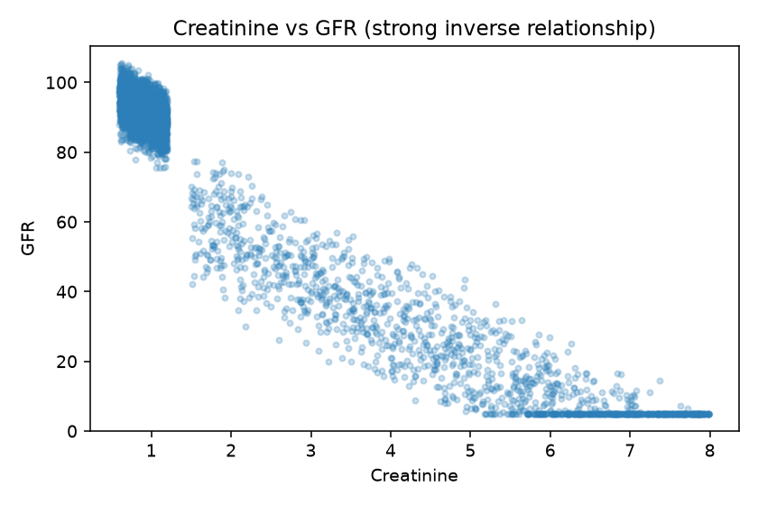
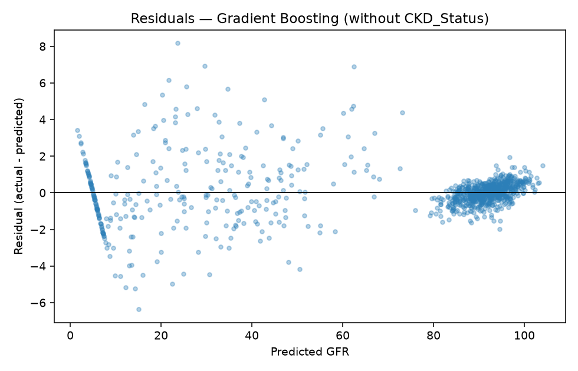
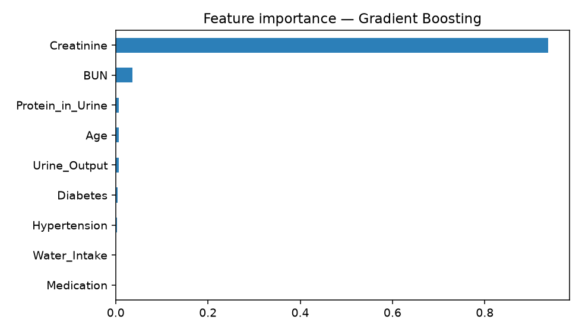

# CKD / GFR Regression Analysis

**Language:** [English](#english) | [Русский](README.ru.md)

---

## English

### Project description
Machine learning project: predict **GFR** (kidney function) from clinical tabular features.

### Methodology fix (important)
`CKD_Status` is **not used** in the final model.  
CKD labels are typically derived from GFR stages, so using CKD status to predict GFR would be circular / leakage-like.

High R² is still expected because **GFR is strongly linked to Creatinine** (correlation ≈ -0.96).

### Results (test set, without `CKD_Status`)

| Model | Test R² | MAE | RMSE | CV R² |
|-------|---------|-----|------|-------|
| Gradient Boosting | **0.9983** | 0.818 | 1.336 | 0.9978 |
| Linear Regression | 0.9909 | 1.754 | 3.095 | 0.9899 |

Leakage check (Linear Regression **with** `CKD_Status`, not used finally): R² ≈ 0.9931

### Pipeline
1. EDA + correlation checks  
2. Drop `CKD_Status` from features  
3. Train/test split  
4. Encode `Medication` on train only  
5. Compare Linear Regression vs Gradient Boosting (CV + test)  
6. Residual diagnostics + feature importance  

### How to run
```bash
pip install -r requirements.txt
jupyter notebook notebooks/ckd_regression_analysis.ipynb
```

### Repository structure
```
ckd-regression-analysis/
├── notebooks/ckd_regression_analysis.ipynb
├── data/kidney_dataset.csv
├── data/DATA.md
├── images/
│   ├── residuals_gb.png
│   ├── feature_importance.png
│   └── creatinine_vs_gfr.png
├── README.md
├── README.ru.md
├── requirements.txt
├── LICENSE
└── .gitignore
```

### Example plots




### Limitations
- Educational / portfolio project, not a clinical tool
- Near-formula relationship Creatinine→GFR can inflate R²
- Dataset provenance should be treated carefully (see `data/DATA.md`)

### Author
[AnnaKazarian13](https://github.com/AnnaKazarian13)
